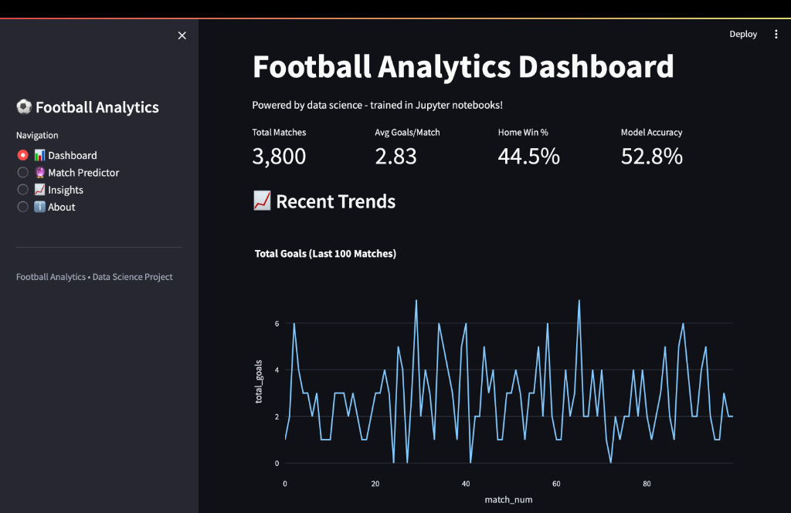
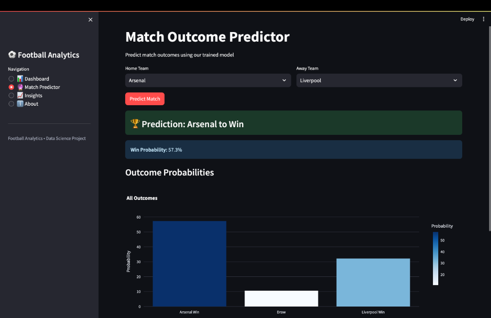

# ⚽ Football Analytics Platform

> *End-to-end data science project predicting Premier League match outcomes*

This project demonstrates a complete data science workflow, from data collection to deployment. It uses XGBoost to predict football match outcomes with 52.8% accuracy through strict temporal validation.


---

## 🎯 For Recruiters & Hiring Managers

This project demonstrates my ability to:
- **Build end-to-end analytics systems**, from raw data ingestion to deployment
- **Leverage Exploratory Data Analysis (EDA)** to drive evidence-based feature engineering
- **Apply machine learning correctly** with strict temporal validation and zero leakage
- **Integrate SQL and Python workflows** for seamless analytics and modeling
- **Deliver production-ready outputs**, including reproducible pipelines and dashboards
- **Communicate decisions**, assumptions, and results clearly

**Scope:** 3,800+ matches · 10 seasons · 15 engineered features · unseen future evaluation

---

## 📸 System Demonstration

### Dashboard Overview
Interactive metrics and visualizations showing match statistics and trends.



### Match Predictor
Select any two teams and get instant win/draw/loss probabilities with clear predictions.



---

## 📊 Project Overview

- **3,800** Premier League matches (2015-2025, 10 complete seasons)
- **15** engineered features (ELO ratings, rolling averages, momentum, temporal context)
- **52.8%** prediction accuracy (clean time-based validation, zero data leakage)
- **XGBoost** classifier with hyperparameter tuning
- **Interactive dashboard** built with Streamlit

---

## 📈 Model Performance

### Results

| Metric | Value |
|--------|-------|
| **Test Accuracy** | 52.8% |
| **Cross-Validation** | 47.4% ± 2.8% |
| **Baseline** | 43.4% (always predict home) |
| **Improvement** | +9.3 percentage points |
| **Algorithm** | XGBoost Classifier |

### Performance Context


- **Outperforms random probability** (33%) by 18.8 percentage points
- **Beats naive baseline** by 9.3 points
- **Honest evaluation** with strict temporal validation
- **No data leakage** - provably clean features
- **Benchmarks competitively against published research** (53-58% range)

Football is inherently unpredictable. Our model demonstrates real predictive capability on unseen future data.

---

## 🔬 Feature Engineering

**From Raw Data to Features:**
The database contains basic match statistics (17 columns). We engineered 15 predictive features:

### Top 10 Features by Importance

| Rank | Feature | Importance | Type |
|------|---------|------------|------|
| 1 | elo_diff | 0.127 | Standard |
| 2 | away_goals_avg | 0.067 | **Custom** |
| 3 | h2h_home_wins | 0.066 | Standard |
| 4 | rest_days | 0.066 | **Custom** |
| 5 | season_progress | 0.066 | **Custom** |
| 6 | home_goals_avg | 0.065 | **Custom** |
| 7 | away_clean_sheets | 0.064 | **Custom** |
| 8 | away_win_streak | 0.063 | **Custom** |
| 9 | home_conceded_avg | 0.063 | **Custom** |
| 10 | form_diff | 0.063 | Standard |

**12 of 15 features (80%)** are custom implementations beyond basic statistics.

### Data Leakage Prevention

All features use only historical data:
- **Rolling averages:** `.shift(1)` ensures no current match data
- **ELO ratings:** Updated sequentially after each match
- **Streaks/form:** Calculated from past matches only
- **Time-based split:** Train on 2015-2022, test on 2023-2024
Current Ongoing Season : 2025

---

## 📁 Project Structure

```
football-analytics/
├── data/
│   └── database/
│       └── football.db              # 3,800 matches (2015-2024)
│
├── models/
│   ├── simple_model.pkl             # Trained XGBoost (52.8%)
│   ├── features.json                # 15 feature names
│   └── model_metadata.json          # Training metrics
│
├── notebooks/
│   ├── 01_exploratory_data_analysis.ipynb
│   ├── 02_feature_engineering.ipynb
│   └── 03_model_development.ipynb
│
├── utils.py                         # Feature engineering functions
├── train_model.py                   # Production training script
├── app_simple.py                    # Streamlit dashboard
└── README.md                        # This file
```

### 🗄️ Data Schema
The project uses **SQLite** to simulate a production-grade data store, ensuring type safety and scalability beyond simple CSVs.

**Table: `matches`**
| Column | Type | Description |
| :--- | :--- | :--- |
| `id` | INTEGER | Primary Key |
| `competition` | TEXT | League (e.g., 'Premier League') |
| `season` | INTEGER | Season start year (e.g., 2023) |
| `utc_date` | TIMESTAMP | Match kick-off time (UTC) |
| `home_team_name` | TEXT | Home team name |
| `away_team_name` | TEXT | Away team name |
| `home_score` | INTEGER | Goals scored by home team |
| `away_score` | INTEGER | Goals scored by away team |
| `winner` | TEXT | Target Variable ('HOME_TEAM', 'AWAY_TEAM', 'DRAW') |


---

## 💻 Technical Stack

### Core Analytics & Modeling
- **Python 3.8+ with pandas** for data processing and feature engineering
- **scikit-learn and XGBoost** for model training, evaluation, and validation
- **SQLite** for structured data storage and analytical querying

### Analysis & Experimentation
- **Jupyter Notebooks** for exploratory analysis, feature validation, and experimentation

### Visualization & Delivery
- **Streamlit** for interactive, user-facing dashboards
- **Plotly** for dynamic visualizations
- **Matplotlib / Seaborn** for exploratory and diagnostic plots

---

## 🏗️ Installation & Usage

### Prerequisites
- Python 3.8+
- Virtual environment recommended

### Quick Start
```bash
# Clone repository
git clone https://github.com/yourusername/football-analytics.git
cd football-analytics

# Create virtual environment
python -m venv venv
source venv/bin/activate  # Windows: venv\Scripts\activate

# Install dependencies
pip install -r requirements.txt

# Run dashboard
streamlit run app_simple.py
```
The database is included, so no data fetching required!

---

## 🚧 Future Enhancements

**Production Readiness:**
- Deploy to cloud (Streamlit Cloud/Heroku)
- Automate data updates
- CI/CD pipeline
- Model versioning

**Model Improvements:**
- Player-level statistics
- External data (weather, injuries)
- Team Analytics
- New leagues (La Liga, Bundesliga and more!)


---

## 📖 Documentation

- `SETUP_GUIDE.md` - Complete installation and setup instructions
- `LICENSE` - MIT License for open source use

---

## 📧 Connect

**Built by:** [Abhinav Dhindsa]
**Contact:** [dhindsaabhinav@gmail.com]  
**LinkedIn:** [www.linkedin.com/in/abhidhindsa]

---

## 📄 License

MIT License - see [LICENSE](LICENSE) for details

---

**This project demonstrates skills applicable to data science roles.**

*Last Updated: January 2026*
